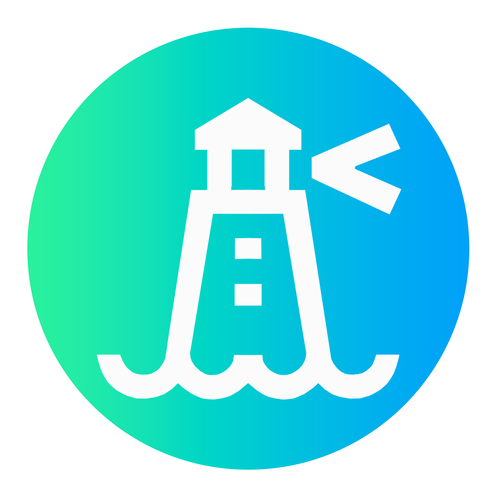

# Visualization as a Service (VaaS) &middot;   

 

## Table of Contents

- [What is VaaS?](#what-is-vaas)
- [Features](#current-features)
- [Getting Started](#getting-started)
- [Team](#team)
- [Show Your Support](#show-your-support)
- [License](#license)

 

## What is VaaS?

Visualization as a Service ("VaaS") is an open-source tool that allows users to monitor their Kubernetes clusters in real-time via powerful performance and cost metrics visualization dashboards. VaaS also offers users a platform-agnostic solution for deploying serverless functions into their clusters via OpenFaaS integration. It will eventually be a one-stop shop for all of your Kubernetes monitoring and maintenance needs.

VaaS is actively being developed with the support of OSLabs and we are always looking for contributors and feedback.

 

## Features

- Monitoring key metrics of multiple clusters from a centralized dashboard
- Graphical visualization of your clusters including all pods, services, deployments, and their status, powered by KubeView
- In-depth graphical visualization of key cluster metrics, powered by Grafana
- Execution of custom queries on your cluster via the Prometheus API
- Monthly cost forcasting by common cost categories, powered by Kubecost
- Deployment, invocation, deletion, and cost estimates of serverless functions via OpenFaaS

 

## Getting Started

Check out our [setup](/SETUP.md) guide for instructions on how to get started with VaaS.

 

## Team

Feel free to reach out to us with any questions or feedback!

- **Brandon Muniz-Rosado** - [Github](https://github.com/BrandonMuniz1) - [LinkedIn](https://www.linkedin.com/in/brandon-muniz-389790263/)
- **Christopher Tenorio** - [Github](https://github.com/DankWolf) - [LinkedIn](https://www.linkedin.com/in/christopher-tenorio/)
- **Johanna Merluza** - [Github](https://github.com/johannamerluza) - [LinkedIn](https://www.linkedin.com/in/johannamerluza/)
- **Steven Tong** - [Github](https://github.com/ykim770) - [LinkedIn](https://www.linkedin.com/in/steven-tong-b5578991/)
- **Terrence Granger** - [Github](https://github.com/Terinss) - [LinkedIn](https://www.linkedin.com/in/terrence-granger/)
- **Young Kim** - [Github](https://github.com/ykim770) - [LinkedIn](www.linkedin.com/in/young-j-kim)
- **Ahsan Ali** - [Github](https://github.com/greyali) - [LinkedIn](https://www.linkedin.com/in/greyali/)
- **Rabea Ahmad** - [Github](https://github.com/RabeaAhmad3) - [LinkedIn](https://www.linkedin.com/in/rabea-ahmad/)
- **Stephan Chiorean** - [Github](https://github.com/stephan-chiorean) - [LinkedIn](https://www.linkedin.com/in/stephan-chiorean-2b6961139/)
- **Ruqayaah Sabitu** - [Github](https://github.com/ruqayaahh) - [LinkedIn](https://www.linkedin.com/in/ruqayaahsabitu/) - [Email](mailto:aderinolaruqayaah@gmail.com)
- **James Chan** - [Github](https://github.com/j-chany) - [LinkedIn](https://www.linkedin.com/in/james-c-694018b5/)
- **Jimmy Lim** - [Github](https://github.com/Radizorit) - [LinkedIn](https://www.linkedin.com/in/limjimmyy)
- **Alex Kaneps** - [Github](https://github.com/AlexKaneps) - [LinkedIn](https://www.linkedin.com/in/alex-kaneps/)
- **Matthew McGowan** - [Github](https://github.com/mcmcgowan) - [LinkedIn](https://www.linkedin.com/in/matthewcharlesmcgowan/)
- **Vu Duong** - [Github](https://github.com/vduong021) - [LinkedIn](https://www.linkedin.com/in/vu-duong)
- **Murad Alqadi** - [Github](https://github.com/murad-alqadi) - [Portfolio](http://murad.md/)
- **Kevin Le** - [Github](https://github.com/xkevinle) - [LinkedIn](https://www.linkedin.com/in/xkevinle/)
- **Richard Zhang** - [Github](https://github.com/rich9029) - [LinkedIn](https://www.linkedin.com/in/dickzhang/)
- **Irvin Ie** - [Github](https://github.com/irvinie) - [LinkedIn](https://www.linkedin.com/in/irvinie/)

 

## Show Your Support

If you like this project, please give it a ⭐️!

 

## License

By contributing, you agree that your contributions will be licensed under its [MIT License](/LICENSE).

