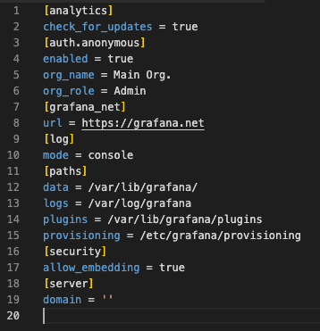

# Installation / Setup Instructions

To get started, you will need to have a Kubernetes cluster. If you are new to Kubernetes, you can create a simple single-node cluster on your local machine by using minikube. See documentation for minikube at [link](https://minikube.sigs.k8s.io/docs/start/).

Follow the instructions below to install dependencies required by VaaS. To have the dependencies work properly with VaaS, the service types of each application must be changed to ```LoadBalancer```. You can learn more about service types at [link](https://kubernetes.io/docs/concepts/services-networking/service/).

<br/>

### Helm

Helm is a package manager for Kubernetes that allows you to easily install and manage applications in your Kubernetes cluster.

Install Helm by following the instructions at this [link](https://helm.sh/docs/intro/quickstart/).

<br/>

### Kube-Prometheus Stack

The kube-prometheus stack is a collection of applications for monitoring Kubernetes clusters. See documentation at &nbsp;[link](https://github.com/prometheus-community/helm-charts/blob/main/charts/kube-prometheus-stack/README.md).

Begin by creating a new namespace in your cluster named ```monitoring```:

```
kubectl create namespace monitoring
```

Add the prometheus-community repo to Helm:

```
helm repo add prometheus-community https://prometheus-community.github.io/helm-charts
helm repo update
```

Install kube-prometheus stack:

```
helm install kubepromstack prometheus-community/kube-prometheus-stack --namespace=monitoring
```

<br/>


### OpenCost/KubeCost Community Version

OpenCost/KubeCost is a Kubernetes cost monitoring tool upon which VaaS's budget and forecasting features are built upon. See documentation at [link](https://docs.kubecost.com/).

```
helm install kubecost cost-analyzer \
--repo https://kubecost.github.io/cost-analyzer/ \
--namespace kubecost --create-namespace \
--set kubecostToken="Q3l0b25nMzMxQGdtYWlsLmNvbQ==xm343yadf98"
--set prometheus.nodeExporter.enabled=false \
--set prometheus.serviceAccounts.nodeExporter.create=false \
--set prometheus.kubeStateMetrics.enabled=false
```

<br/>

### KubeView
KubeView is a web-based UI that allows you to view the status of your Kubernetes cluster. See documentation at &nbsp;[link](https://artifacthub.io/packages/helm/kubeview/kubeview?modal=install).

```
helm repo add kubeview https://benc-uk.github.io/kubeview/charts
helm install my-kubeview kubeview/kubeview --version [CURRENT VERSION] --namespace=monitoring
```

_Note: replace [CURRENT VERSION] in the above command with the latest version by visiting KubeView's documentation._

<br/>

### OpenFaaS
OpenFaaS is a serverless framework for Kubernetes. It allows you to deploy functions to Kubernetes without having to worry about the underlying infrastructure.

Install Arkade, a CLI tool that allows us to install OpenFaaS with a single command:

```
brew install arkade
```

Install OpenFaaS and the OpenFaaS CLI using Arkade:

```
arkade install openfaas
arkade get faas-cli
```

<br/>

## Access and Port-Forwarding
Some components of ```kube-prometheus stack``` come with their own GUIs, which can be accessed via ```kubectl port-forward```.

<br/>

### Prometheus
      
```
kubectl -n monitoring port-forward svc/kubepromstack-kube-prometh-prometheus 30000:9090
```
Accessed via http://localhost:30000

<br/>

### Kube State Metrics

```
kubectl -n monitoring port-forward svc/kubepromstack-kube-state-metrics 30135:8080
```
Accessed via http://localhost:30135

<br/>

### Alert Manager

```
kubectl -n monitoring port-forward svc/kubepromstack-kube-prometh-alertmanager 31000:9093
```
Accessed via http://localhost:31000

<br/>

### Grafana
      
```
kubectl -n monitoring port-forward svc/kubepromstack-grafana 3001:3000
```
Accessed via http://localhost:3001:3000

_The default ```username:password``` are ```admin:prom-operator```._

<br/>

### OpenCost/KubeCost

```
kubectl -n kubecost port-forward deployment/kubecost-cost-analyzer 9090
```
Accessed via http://localhost:9090

<br/>

### OpenFaaS
Forward the OpenFaas gateway service from ```port 8080``` to ```port 30001``` as it is occupied by Kube State Metrics:

```
kubectl rollout status -n openfaas deploy/gateway
kubectl -n openfaas port-forward svc/gateway 30001:8080
```

Export the OpenFaaS URL:

```
export OPENFAAS_URL=http://127.0.0.1:30001/
```

Log into the OpenFaaS dashboard:

```
PASSWORD=$(kubectl get secret -n openfaas basic-auth -o jsonpath="{.data.basic-auth-password}" | base64 --decode; echo)
echo $PASSWORD
echo -n $PASSWORD | faas-cli login --username admin --password-stdin
```

<br/>

# Grafana Configuration

Additional Grafana configurations are required for the graphical interfaces to render properly through VaaS. In the ```monitoring``` namespace, find the Config Map ```kubepromstack-grafana``` and change the configuration as follows:



<br/>

# Cypress Testing Configuration

To utilize Cypress, create a ```cypress.env.json``` file with your cluster's configuration:

```
{
   "mongodb": {
      "uri": "",
      "database": "",
      "collection": ""
   },
   "testCluster": {
      "name": "",
      "desc": "",
      "promUrl": "",
      "faasUrl": "",
      "faasPort": "",
      "grafanaUrl": "",
      "kubeUrl": "",
      "faasUser": "",
      "faasPw": "",
      "costUrl": "",
      "costPort": "",
   }
}
```

To learn more about Cypress E2E testing, visit [the official Cypress documentation](https://docs.cypress.io/guides/overview/why-cypress).

<br/>

# VaaS Setup

Clone the VaaS repo from GitHub to your machine.

```
git clone https://github.com/oslabs-beta/VaaS.git
```

Install other dependencies. _At this time, you will need to use the specific command below due to issues with some packages being deprecated._

```
npm install --legacy-peer-deps
```

A mongoDB database is required to sign into VaaS and utilize its functionalities. Create a ```.env``` file in the root folder of VaaS with the following fields:

```
JWT_ACCESS_SECRET=hello
JWT_REFRESH_SECRET=hello
JWT_EXP=400000000
JWT_GRACE=4000000000

MONGO_URL=
MONGO_PORT=
MONGO_USERNAME=
MONGO_PASSWORD=
MONGO_COLLECTION=
MONGO_DATABASE=
MONGO_DATABASE_TEST=

EXPRESS_PORT=
EXPRESS_CONSOLE_LOG=off
```

If you're using a cloud database, you can simply copy the connection string and paste it into the environment variable file. If you're using localhost, you will need to install MongoDB and create a database.

Once the above steps are complete, run the following command:

```
npm run dev:server
```

   or

```
yarn dev:server
```

_Run the following command if you use a Windows OS:_

```
npm run dev:windows
```

<br/>